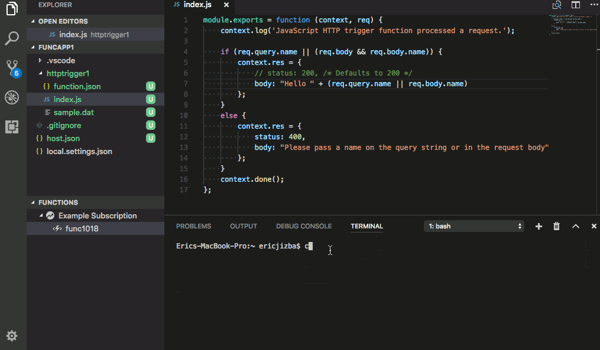

# Azure Functions for Visual Studio Code (Preview)

## Prerequisites
* [Node v8.0+](https://nodejs.org/)
  * Older versions of node will be supported soon. See issue [#1](https://github.com/Microsoft/vscode-azurefunctions/issues/1)
* [.NET Core 2.0](https://www.microsoft.com/net/download/core)
* [Azure Core Function Tools 2.0](https://www.npmjs.com/package/azure-functions-core-tools)
  ```
  npm install --global azure-functions-core-tools@core
  ```

## Features

* Create new project
* Create new function from template
* Debug function projects locally
* View Azure Function Apps
* Deploy to Azure Function Apps
* Create, delete, start, stop, and restart Azure Function Apps
* JSON Intellisense for `function.json`, `host.json`, and `proxies.json`

### Create New Project


### Debug function app locally


### Deploy to Azure as Zip



## Contributing
There are a couple of ways you can contribute to this repo:

- **Ideas, feature requests and bugs**: We are open to all ideas and we want to get rid of bugs! Use the Issues section to either report a new issue, provide your ideas or contribute to existing threads.
- **Documentation**: Found a typo or strangely worded sentences? Submit a PR!
- **Code**: Contribute bug fixes, features or design changes:
  - Clone the repository locally and open in VS Code.
  - Install [TSLint for Visual Studio Code](https://marketplace.visualstudio.com/items?itemName=eg2.tslint).
  - Open the terminal (press `CTRL+`\`) and run `npm install`.
  - To build, press `F1` and type in `Tasks: Run Build Task`.
  - Debug: press `F5` to start debugging the extension.

### Legal
Before we can accept your pull request you will need to sign a **Contribution License Agreement**. All you need to do is to submit a pull request, then the PR will get appropriately labelled (e.g. `cla-required`, `cla-norequired`, `cla-signed`, `cla-already-signed`). If you already signed the agreement we will continue with reviewing the PR, otherwise system will tell you how you can sign the CLA. Once you sign the CLA all future PR's will be labeled as `cla-signed`.

### Code of Conduct
This project has adopted the [Microsoft Open Source Code of Conduct](https://opensource.microsoft.com/codeofconduct/). For more information see the [Code of Conduct FAQ](https://opensource.microsoft.com/codeofconduct/faq/) or contact [opencode@microsoft.com](mailto:opencode@microsoft.com) with any additional questions or comments.

## Telemetry
VS Code collects usage data and sends it to Microsoft to help improve our products and services. Read our [privacy statement](https://go.microsoft.com/fwlink/?LinkID=528096&clcid=0x409) to learn more. If you don’t wish to send usage data to Microsoft, you can set the `telemetry.enableTelemetry` setting to `false`. Learn more in our [FAQ](https://code.visualstudio.com/docs/supporting/faq#_how-to-disable-telemetry-reporting).

## License
[MIT](LICENSE.md)
