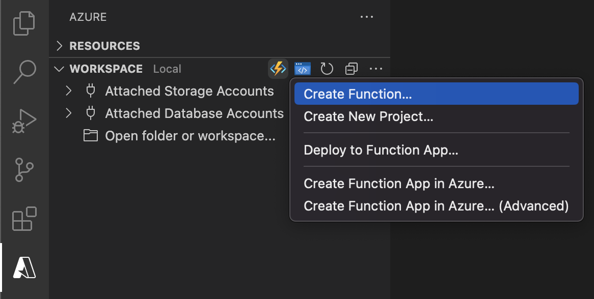

# Azure Functions for Visual Studio Code

<!-- region exclude-from-marketplace -->

  

<!-- endregion exclude-from-marketplace -->

Use the Azure Functions extension to quickly create, debug, manage, and deploy serverless apps directly from VS Code. Check out the [Azure serverless community library](https://aka.ms/AA4ul9b) to view sample projects.

**Visit the [wiki](https://github.com/Microsoft/vscode-azurefunctions/wiki) for more information about Azure Functions and how to use the advanced features of this extension.**

> Sign up today for your free Azure account and receive 12 months of free popular services, $200 free credit and 25+ always free services 👉 [Start Free](https://azure.microsoft.com/free/open-source).

## Create your first serverless app

1. Select the button to create a new project in the Azure Functions explorer

    

1. Select a new, _empty_ folder to contain your project
1. Select your desired programming language
1. Select "HTTP trigger" for your project's first function
1. Use "HttpTrigger1" as the function name
1. Select "Anonymous" for the authorization level, which enables anyone to call your function endpoint without a key.
    > To learn more about authorization levels, see [here](https://docs.microsoft.com/azure/azure-functions/functions-bindings-http-webhook-trigger?tabs=csharp#authorization-keys).
1. If the selected folder is not already open, select "Open in current window" to open it

## Run the serverless app locally

This extension integrates with the [Azure Functions Core Tools](https://docs.microsoft.com/azure/azure-functions/functions-run-local) to let you run your project locally before publishing to Azure.

1. To start your project, press F5 or the "play" button

    

1. If you do not have the [Azure Functions Core Tools](https://aka.ms/Dqur4e) installed, you will be automatically prompted to install. Follow the specified instructions, or skip to the "Deploy" step if you would rather deploy without running locally.
    > TIP: The "Terminal" panel should pop up automatically and you know your project is running if you see output
1. Expand your _local project_ in the Azure Functions explorer to copy your function's url

    

1. Navigate to a browser, paste the url, and append `?name=world`
    > TIP: Your url should look like this: `http://localhost:7071/api/HttpTrigger1?name=world`
1. A response of "Hello world" is returned in the browser and you know your function worked!
1. Select the "Detach" button to stop your project from running locally

    

## Deploy to Azure

1. Sign in to your Azure Account by clicking "Sign in to Azure..." in the Azure Functions explorer
    >  If you don't already have an Azure Account, click "Create a Free Azure Account"
1. Select the 'plus' button to open the "Create Resource" menu

    

1. Choose "Create Function App in Azure..."

    

1. Enter a globally unique name for your Function App
1. If multiple versions of your language's runtime are supported (i.e. Node.js 10 and Node.js 12), select your desired version (the latest is recommended)
1. Select a location
1. Wait for your Function App to be created. Progress will be shown in the Activity Log panel

    

1. Once your Function App has been created, reveal the resource in the Resources view.

    

1. Right click your Function App and select "Deploy to Function App"

    

1. Once deployment is complete, expand your _subscription_ in the Azure Functions explorer to copy your deployed function's url

    

1. Navigate to a browser, paste the url, and append `?name=world`
    > TIP: Your url should look like this: `https://<function app name>.azurewebsites.net/api/HttpTrigger1?name=world`
1. A response of "Hello world" is returned in the browser and you know your function worked!

<!-- region exclude-from-marketplace -->

## Contributing

There are a couple of ways you can contribute to this repo:

* **Ideas, feature requests and bugs**: We are open to all ideas and we want to get rid of bugs! Use the Issues section to either report a new issue, provide your ideas or contribute to existing threads.
* **Documentation**: Found a typo or strangely worded sentences? Submit a PR!
* **Code**: Contribute bug fixes, features or design changes:
  * Clone the repository locally and open in VS Code.
  * Run "Extensions: Show Recommended Extensions" from the [command palette](https://code.visualstudio.com/docs/getstarted/userinterface#_command-palette) and install all extensions listed under "Workspace Recommendations"
  * Open the terminal (press <kbd>CTRL</kbd>+ <kbd>\`</kbd>) and run `npm install`.
  * To build, press <kbd>F1</kbd> and type in `Tasks: Run Build Task`.
  * Debug: press <kbd>F5</kbd> to start debugging the extension.

### Legal

Before we can accept your pull request you will need to sign a **Contribution License Agreement**. All you need to do is to submit a pull request, then the PR will get appropriately labelled (e.g. `cla-required`, `cla-norequired`, `cla-signed`, `cla-already-signed`). If you already signed the agreement we will continue with reviewing the PR, otherwise system will tell you how you can sign the CLA. Once you sign the CLA all future PR's will be labeled as `cla-signed`.

### Code of Conduct

This project has adopted the [Microsoft Open Source Code of Conduct](https://opensource.microsoft.com/codeofconduct/). For more information see the [Code of Conduct FAQ](https://opensource.microsoft.com/codeofconduct/faq/) or contact [opencode@microsoft.com](mailto:opencode@microsoft.com) with any additional questions or comments.

<!-- endregion exclude-from-marketplace -->

## Telemetry

VS Code collects usage data and sends it to Microsoft to help improve our products and services. Read our [privacy statement](https://go.microsoft.com/fwlink/?LinkID=528096&clcid=0x409) to learn more. If you don’t wish to send usage data to Microsoft, you can set the `telemetry.enableTelemetry` setting to `false`. Learn more in our [FAQ](https://code.visualstudio.com/docs/supporting/faq#_how-to-disable-telemetry-reporting).

## Lifecycle

The Azure Functions extension for VS Code follows the [Modern Lifecycle Policy](https://docs.microsoft.com/lifecycle/policies/modern). Follow instructions [here](https://code.visualstudio.com/docs/editor/extension-gallery) to get the latest updates of the extension.

### Support Dates
|Version|Start Date|Retirement Date|
|---|---|---|
|1.x|10/20/2020|In Support|

## License

[MIT](LICENSE.md)
